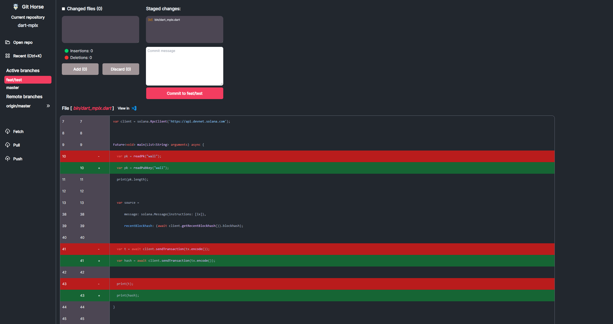

<p align="center">
	<h1 align="center">git-horse</h1>
  
</p>

git-horse is a git client for Desktop (WIP).

[](./public/screenshot.png)

## 🚀 Upcoming features
- Push branch to origin
- Tree file
- Switching between branches and bringing changes to the new branch (`git switch`)

## 📑 Goals
- No freezes or lags
- Fast startup time
- Low memory usage
- Reliable
- Smooth UX

## ⚓ Building from source

```
npm install
npm run tauri dev
```

MIT License